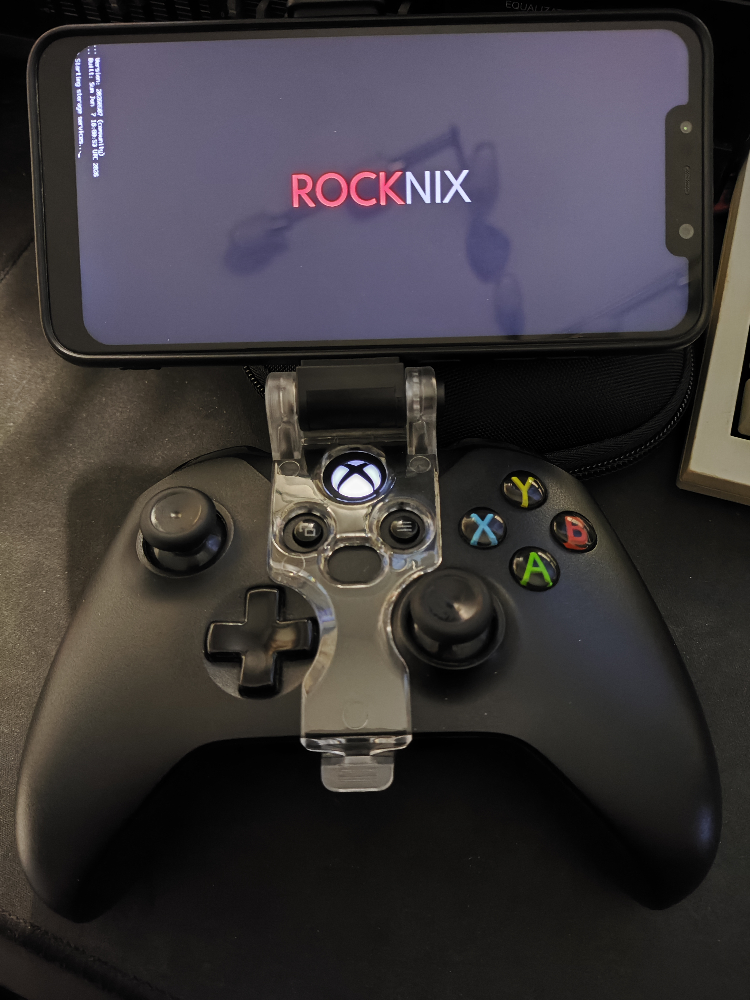
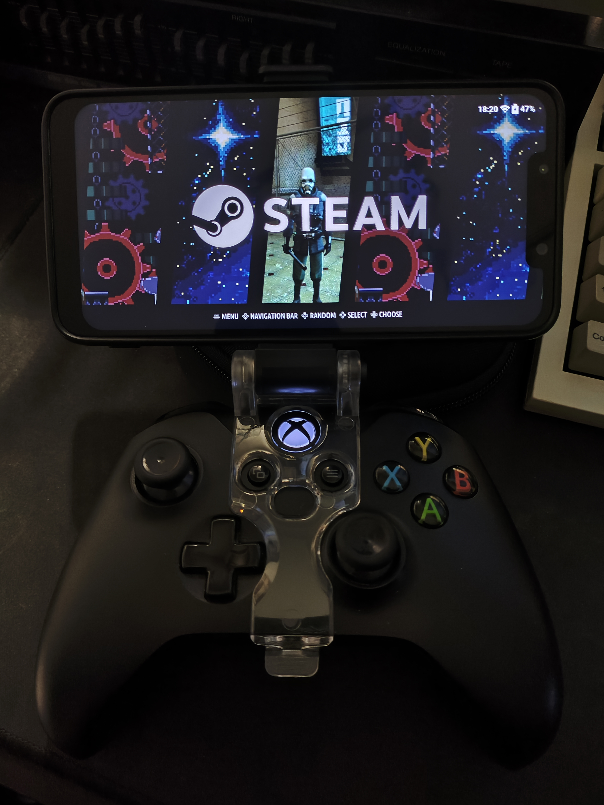
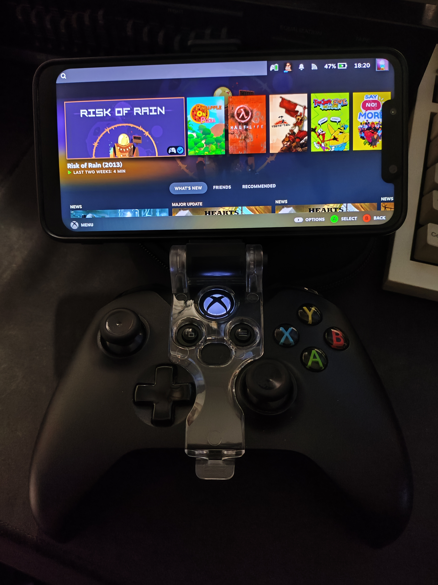
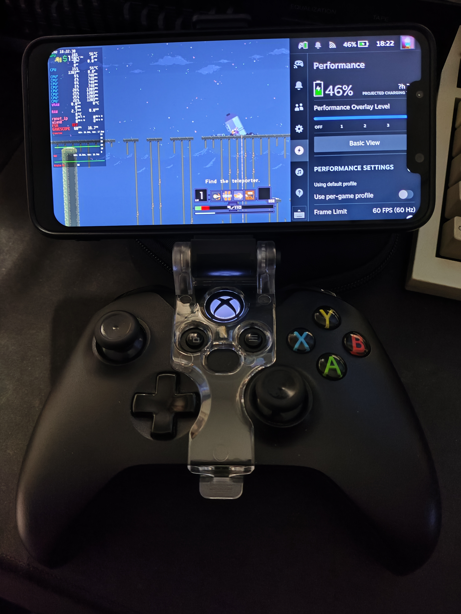
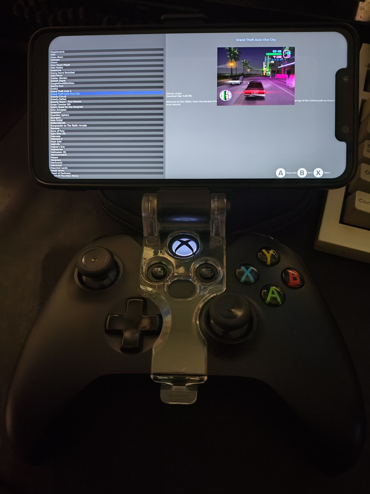

# Unofficial ROCKNIX port - Xiaomi Poco F1 (beryllium)

**Personal, experimental, unofficial.** A ROCKNIX device port for the Xiaomi
Poco F1 (codename *beryllium*, Snapdragon 845 / Adreno 630), built as a handheld
emulation + Steam device.

The Poco F1 shipped with one of two display panels (EBBG or Tianma). This fork
builds a boot image for **both** - flash the one matching your unit (see
*Flashing*). The **EBBG** variant is what I develop and test on; the **Tianma**
variant is built from the same shared device tree but is **untested** (I don't
have that panel) - it should work since only the panel and touch controller
differ, but treat it as experimental.

> **Disclaimer:** This port was built with the help of an agentic AI coding agent
> (**Claude Opus 4.8**). My background is fullstack web development. I'm comfortable
> with Linux distributions and the kernel but I'm not a systems or kernel developer,
> so for this personal, non-commercial project I leaned on AI to bridge that gap and
> get ROCKNIX running on my own device.

## Screenshots

<table>
  <tr>
    <td align="center"><br><sub>Booting ROCKNIX</sub></td>
    <td align="center"><br><sub>EmulationStation (Steam system)</sub></td>
    <td align="center"><br><sub>Steam under gamescope</sub></td>
  </tr>
  <tr>
    <td align="center"><br><sub>In-game: Quick Access Menu + MangoHud</sub></td>
    <td align="center"><br><sub>PortMaster</sub></td>
    <td></td>
  </tr>
</table>

## What works
- Boots to EmulationStation; landscape display, GPU (Adreno 630 via freedreno +
  turnip), storage, WiFi, Bluetooth, battery, suspend, USB host.
- **Emulators** - the SM8250 / Retroid Pocket 5 set (standalone like Dolphin,
  AetherSX2, Azahar, melonDS, Supermodel, plus the libretro cores), **minus the
  heaviest standalone cores** that can't run usefully on this SoC: PS3 (RPCS3),
  Wii U (Cemu), original Xbox (xemu), and PS Vita (vita3k).
- **Steam** - the Steam client itself runs **natively on ARM**; only the x86 /
  x86-64 games run under FEX emulation (+ Proton for Windows titles), composited by
  gamescope (Steam Deck UI).
- **Audio** - headphone jack at full volume; the built-in speaker works
  (TAS2559/2560 smart-amp firmware loads at boot) but plays quieter than stock
  (see *Known issues*). **Bluetooth Xbox controller** (in ES and Steam), and the
  **Quick Access Menu** wirelessly (Guide + A).
- **Idle screen-off** - the panel powers off after 5 minutes with no input
  (key, touch, or controller) and wakes on any input.

## Known issues
- **WiFi MAC / IP changes across reboots.** The WCN3990 has no fused MAC, so the
  `ath10k` driver assigns a random one each boot - and it ignores MAC changes from
  userspace (NetworkManager, `ip link`), so there is no userspace fix. Find its
  IP in EmulationStation's network settings, or by scanning your LAN / checking
  your router.
- **Speaker is quiet (known limitation).** The loudspeaker works but plays
  quieter than stock. This is a limitation of the mainline TAS2559 smart-amp
  driver, which doesn't program the amp's boost voltage (the driver is a known
  rough port still pending a rewrite upstream); postmarketOS has the same
  limitation. Everything user-facing is already maxed. Headphones give full
  volume. Fixing it properly needs a driver-level boost/calibration port, so
  it's left as-is for now.
- **Tianma panel untested.** The Tianma boot image is built but unverified (no
  hardware) - see the note at the top.
- No modem / telephony (this is a gaming build).

## Prebuilt images
Each release attaches **two boot images** (`boot-ebbg.img` and `boot-tianma.img`,
one per panel) plus a shared **system** and **storage** image - see
[Releases](../../releases). Flash the boot image for your panel (see *Flashing*
below) - no build required. To build your own instead, read on.

## Building from source
Requires Docker (the build runs in the ROCKNIX builder container):
```
make docker-SDM845 DOCKER_WORK_DIR=/work
```
- **`DOCKER_WORK_DIR=/work` is required** - the toolchain bakes `/work` into
  binary RUNPATHs, so the repo must be mounted there. Omitting it mounts the host
  path and the build fails while sourcing config.
- 64-bit only (`ENABLE_32BIT=false`); a full build needs a large build tree
  (~100 GB+ of disk).
- Output lands in `target/`: `ROCKNIX-SDM845.aarch64-<date>.tar` (contains
  `KERNEL` = the **EBBG** boot image and `SYSTEM` = the root squashfs) and a full
  `….img.gz` disk image (partition 1 = `system`, partition 2 = `storage`).
- The default build produces the **EBBG** boot image. The kernel tree also builds
  `sdm845-xiaomi-beryllium-tianma.dtb`; the **Tianma** boot image is the same
  `gzip(Image)` + that dtb, repacked with the identical `mkbootimg` geometry. The
  prebuilt releases include both.

## Firmware (you must supply your own)
The proprietary per-device DSP/modem firmware (`adsp.mbn`, `cdsp.mbn`,
`modem.mbn`, `slpi.mbn`, `venus.mbn`, …) is **not redistributable** and is **not
included** (gitignored). Before building, extract it from *your own* device into:
```
projects/ROCKNIX/devices/SDM845/filesystem/usr/lib/kernel-overlays/base/lib/firmware/qcom/sdm845/Xiaomi/beryllium/
```
Get the blobs from your device's `/vendor/firmware*` or a postmarketOS beryllium
install - see [`beryllium-FIRMWARE-README.md`](projects/ROCKNIX/devices/SDM845/filesystem/usr/lib/kernel-overlays/base/lib/firmware/qcom/sdm845/Xiaomi/beryllium-FIRMWARE-README.md) beside that directory. The
redistributable Adreno 630 GPU microcode (`a630_*`) **is** included.

## Flashing
The Poco F1 boots a standard fastboot Android boot image (no signed ABL). Get the
images either from [Releases](../../releases) (extract the compressed ones first),
or from your own build output (in `target/`: the boot image is `KERNEL` inside the
`.tar`; `system` and `storage` are partitions 1 and 2 of the `.img.gz`).

**Pick the boot image for your panel:** `boot-ebbg.img` or `boot-tianma.img`. If
you don't know which panel your unit has, flash one and boot - if the display stays
black, it's the other panel, so reflash `boot` with the other image. The `system`
and `storage` images are identical for both panels.

**First install** flashes three images - `boot`, `system`, and `storage`. With the
phone in fastboot (substitute your panel's boot image):
```
fastboot flash boot     boot-ebbg.img      # or boot-tianma.img
fastboot flash system   system.img
fastboot flash userdata storage.img
fastboot reboot
```
`storage.img` is an ext4 `STORAGE` filesystem that auto-resizes to fill the
partition on first boot. (If the device loops at boot, clear `userdata`'s
partition table and reflash it.)

**Updating** an existing install flashes only `boot` + `system` - leave
`userdata` untouched so Steam, your config, and games persist:
```
fastboot flash boot   boot-ebbg.img        # or boot-tianma.img
fastboot flash system system.img
fastboot reboot
```

## No OTA / online updates
The in-OS "System Update" is **disabled** on this build - the ROCKNIX update
server has no images for an unofficial device, and an OTA would flash a stock
image that won't boot here and wipes the device-specific fixes. **Update only by
fastboot-reflashing a new build** (boot + system; keep `userdata`).

## Steam
After flashing, run **Install Steam** from the menu - it downloads the Steam
client, the FEX x86 rootfs, and Proton to `/storage` (~6 GB, one-time, requires
your Steam login).

## Performance tips (Steam / FEX)
x86 games run under FEX emulation, feeding the Adreno GPU through a Vulkan thunk -
so the rendering path matters a lot:
- **OpenGL games default to zink** (GL → Vulkan → GPU). Without it, x86 Mesa under
  FEX falls back to llvmpipe (software) and is unusably slow, so the Steam launcher
  sets `MESA_LOADER_DRIVER_OVERRIDE=zink` for you. It only affects native-GL games
  (Vulkan and Proton/DXVK titles ignore it). If a game glitches under zink, override
  it per-game with a launch option, e.g. `MESA_LOADER_DRIVER_OVERRIDE=llvmpipe %command%`.
- **Match the path to the engine.** For a **D3D-native engine** (Source - HL2,
  Portal, L4D), the **Windows build via Proton** is usually fastest: D3D → DXVK →
  Vulkan is one clean hop, vs the native Linux port's D3D→GL→zink double-translation.
  For a **GL-native engine** (GoldSrc/Quake-derived, many indies), the **native
  build + zink** wins (one hop, no Wine). When unsure, A/B the two.
- **Lower the render resolution for demanding games.** The panel is **2246×1080**
  (~2.4 MP) - large for the Adreno 630 to fill, so GPU-heavy titles (even 2D ones,
  which have lots of transparent overdraw) can be fragment-bound at native res.
  Drop the resolution per-game or globally in Steam's display settings; rendering
  at ~720p and upscaling often takes a title from ~25 fps to 60.
- **The build pins Steam/FEX to the 4 big A75 cores and runs them at max clock
  while a game is open** (restoring on-demand scaling on exit) for steadier
  frametimes. Note the ceiling for emulated x86 *GL* games is FEX/thunk latency,
  not raw GPU power.
- **Charge with a direct charger, not a USB hub/dock.** A dock enumerates as a
  500 mA data port and can't keep up with gaming; a direct charger negotiates
  ~1.5 A. (Mainline has no Quick Charge, so heavy games may still slowly drain.)

## Kernel
The kernel is fetched **directly** from the
[`sdm845-mainline/linux`](https://gitlab.com/sdm845-mainline/linux) repo at tag
[`sdm845-7.1-rc1-r0`](https://gitlab.com/sdm845-mainline/linux/-/tree/sdm845-7.1-rc1-r0)
(its newest tag; pure mainline does not boot beryllium reliably for this use case). Note this is
the kernel *source* - it's the same tree the postmarketOS `pmaports` recipe
points to, just pulled directly rather than through pmaports' build. If you hit
kernel instability, `sdm845-6.16.7-r0` is the more conservative kernel
postmarketOS ships.

## Credits
This port stands on the work of others:
- **[sdm845-mainline](https://gitlab.com/sdm845-mainline)** - the kernel
  ([`sdm845-mainline/linux`](https://gitlab.com/sdm845-mainline/linux), tag
  `sdm845-7.1-rc1-r0`, fetched directly) and the beryllium ALSA UCM profile
  ([`sdm845-mainline/alsa-ucm-conf`](https://gitlab.com/sdm845-mainline/alsa-ucm-conf)).
- **[postmarketOS / pmaports](https://gitlab.postmarketos.org/postmarketOS/pmaports)**
  - device bring-up reference (kernel config, device tree, firmware packaging).
- **[ROCKNIX](https://github.com/ROCKNIX/distribution)** - the base distribution.
- xpadneo, FEX, Proton-CachyOS, gamescope, and the wider open-source community.

## Scope & support
- **Personal project, no support.** Issues and PRs may go unanswered; no
  guarantees it works for you.
- **EBBG + Tianma panels.** Both boot images are built; EBBG is tested, Tianma is
  built-but-unverified. The `SDM845` target is structured as a generic sdm845
  platform, so take whatever is useful for other sdm845 devices too.
- Not affiliated with or endorsed by the ROCKNIX project.

---

## Original README

&nbsp;&nbsp;&nbsp;&nbsp;&nbsp;&nbsp;[](https://github.com/ROCKNIX/distribution/releases/latest) [](https://github.com/ROCKNIX/distribution/commits) [](https://github.com/ROCKNIX/distribution/pulls) [](https://discord.gg/seTxckZjJy)

---

ROCKNIX is an immutable Linux distribution for handheld gaming devices developed by a small community of enthusiasts.  Our goal is to produce an operating system that has the features and capabilities that we need, and to have fun as we develop it.

## Features

* ROCKNIX has a very active community of developers and users.
* Integrated cross-device local and remote network play.
* In-game touch support on supported devices.
* Fine grain control for battery life or performance.
* Includes support for playing Music and Video.
* Bluetooth audio and controller support.
* Support for HDMI audio and video out, and USB audio.
* Device to device and device to cloud sync with Syncthing and rclone.
* VPN support with Wireguard, Tailscale, and ZeroTier.
* Includes built-in support for scraping and retroachievements.

## Screenshots

<table>
  <tr>
    <td></td>
    <td></td>
  </tr>
  <tr>
    <td></td>
    <td></td>
  </tr>
</table>

## Community

The ROCKNIX community utilizes Discord for discussion, if you would like to join us please use this link: [https://discord.gg/seTxckZjJy](https://discord.gg/seTxckZjJy)

## Licenses

**ROCKNIX** is a fork of [JELOS](https://github.com/JustEnoughLinuxOS/distribution/), all licenses apply and credit to the JELOS team. 

You are free to:

- Share: copy and redistribute the material in any medium or format
- Adapt: remix, transform, and build upon the material

Under the following terms:

- Attribution: You must give appropriate credit, provide a link to the license, and indicate if changes were made. You may do so in any reasonable manner, but not in any way that suggests the licensor endorses you or your use.
- NonCommercial: You may not use the material for commercial purposes.
- ShareAlike: If you remix, transform, or build upon the material, you must distribute your contributions under the same license as the original.

### ROCKNIX Software

Copyright (C) 2024-present [ROCKNIX](https://github.com/ROCKNIX)

Original software and scripts developed by the ROCKNIX are licensed under the terms of the [GNU GPL Version 2](https://choosealicense.com/licenses/gpl-2.0/).  The full license can be found in this project's licenses folder.

### Bundled Works
All other software is provided under each component's respective license.  These licenses can be found in the software sources or in this project's licenses folder.  Modifications to bundled software and scripts by the JELOS team are licensed under the terms of the software being modified.

## Credits

Like any Linux distribution, this project is not the work of one person.  It is the work of many persons all over the world who have developed the open source bits without which this project could not exist.  Special thanks to CoreELEC, LibreELEC, JELOS, and to developers and contributors across the open source community.
